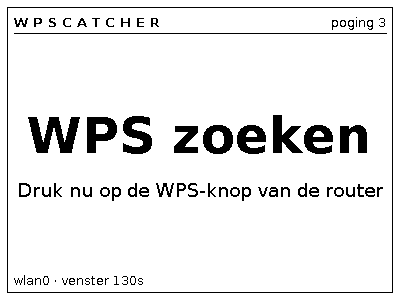
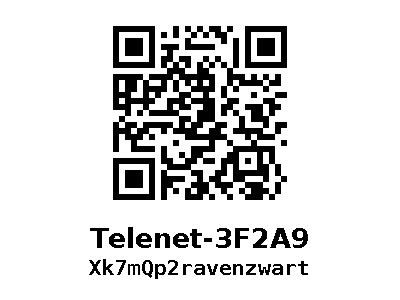

# wpscatcher

Verbindt bij het opstarten via WPS met een router en toont de verkregen
wifi-gegevens als QR-code op een e-ink schermpje. Twee schermen, meer niet.

```
       ┌──────────────────┐              ┌──────────────────┐
       │  WPS zoeken      │   gelukt     │   ███ ██  ███    │
       │  druk op de knop │  ─────────▶  │   ██ ████ █ █    │
       │        poging 3  │              │   MijnNetwerk    │
       │                  │              │   w4chtw00rd     │
       └──────────────────┘              └──────────────────┘
              ▲                                    │
              └──────── verbinding weg ────────────┘
```




Het wachtwoord staat er in mono voluit bij: scannen is de snelle weg,
overtypen de weg die altijd werkt — een laptop of desktop zonder camera kan
niet scannen. Wil je het wachtwoord niet leesbaar op het scherm, zet dan
`show_password = no` in `config.ini`.

Dat kost de QR bijna niets. Gemeten met `test_render.py`:

| Paneel | met wachtwoord | zonder | winst |
|---|---|---|---|
| 2,13" 250×122 | 3 px/module | 3 px/module | geen |
| 2,9" 296×128 | 3 px/module | 3 px/module | geen |
| 4,2" 400×300 | 6 px/module | 7 px/module | 1 px/module |
| 7,5" 800×480 | 13 px/module | 13 px/module | geen |

Op de smalle panelen wordt de QR begrensd door de schermhoogte en niet door
de tekstkolom, dus daar is het gratis.

E-ink houdt zijn beeld vast zonder stroom: een uitgeschakeld toestel toont het
wachtwoord dus gewoon verder. Daarom wist wpscatcher bij een nette stop
(`systemctl stop`, afsluiten) het scherm. Uit te zetten met
`clear_on_stop = no`.

## Zichzelf afsluiten

Zodra de QR er staat heeft het toestel niets meer te doen, en het e-ink houdt
dat beeld vast zonder stroom. Met `shutdown_after` in `[power]` sluit het
zichzelf dan netjes af:

```ini
[power]
shutdown_after = 30
give_up_after = 5
```

Dat lost het echte probleem op: er draait geen bestandssysteem meer op het
moment dat je de stekker eruit trekt, en dat is wat SD-kaarten sloopt. Het
scherm wordt in dit geval **niet** gewist — dat beeld is juist waarvoor je
het aanzette.

### Het scherm wissen

```ini
[ui]
clear_on_start = yes

[power]
shutdown_after = 300
blank_before_shutdown = yes
```

`clear_on_start` wist het paneel zodra het programma start. Dat haalt ghosting
van de vorige sessie weg en zorgt dat een half mislukte start niet de QR van
de vorige klant laat staan.

`blank_before_shutdown` wist het vlak voor het afsluiten. Dat is de veilige
stand als je de code meteen gebruikt: die QR is het wifi-wachtwoord van je
klant in machineleesbare vorm, en e-ink houdt dat weken vast — ook
uitgeschakeld, ook in je tas. Heb je het eenmaal aan je telefoon toegevoegd,
dan heb je het beeld nergens meer voor nodig.

**Eenmaal gewist krijg je het niet terug zonder opnieuw bij die router te
staan.** Kies `shutdown_after` dus naar hoe je werkt: scan je meteen ter
plaatse, dan volstaat 300 (vijf minuten) ruim. Gebruik je de code pas later,
zet het dan hoger — of laat `blank_before_shutdown` op `no`.

`give_up_after` sluit ook af na een aantal mislukte WPS-pogingen (één poging
duurt ~140 s). Eeuwig blijven proberen kost stroom; op accu is dat het
verschil tussen een lege pack en een toestel dat je morgen gewoon aanzet.

Beide staan standaard op 0 (uit). Zet ze pas aan als de eerste boot bewezen
heeft dat alles werkt — anders schakelt het toestel zichzelf uit terwijl je
nog aan het debuggen bent.

Let op: `poweroff` op een kale Pi Zero haalt het verbruik niet naar nul. Het
bord blijft in halt-toestand zo'n 15–25 mA trekken, tegen ~130 mA draaiend.
Voor de SD-kaart is het probleem daarmee weg, voor de accu grotendeels — maar
echt nul wordt het pas als je de stroom eraf haalt.

## Hoe het werkt

Het toestel draait zijn **eigen `wpa_supplicant`**, niet NetworkManager — NM
kan geen WPS. Met `update_config=1` schrijft de supplicant het resultaat van
een geslaagde `wps_pbc` weg als `psk="hetwachtwoord"`, letterlijk leesbaar.
Dat plaintext wachtwoord is precies wat een wifi-QR nodig heeft; uit de
32-byte hash die sommige stacks bewaren valt geen QR te maken.

De lus is simpel: scherm 1 tonen → `wps_pbc` → maximaal 130 s wachten →
gelukt? credentials uitlezen en scherm 2 tonen → niet gelukt? `wps_cancel`,
even wachten, opnieuw. Valt de verbinding later weg, dan begint hij opnieuw
bij scherm 1.

E-ink wordt alleen bij een echte toestandswissel ververst, nooit op een timer,
en gaat na elke refresh weer slapen. Dat scheelt slijtage en stroom.

## Hardware

| Onderdeel | Keuze | Waarom |
|---|---|---|
| Bord | Pi Zero 2 **WH**, of gewoon Zero **WH** | de H = header al gesoldeerd |
| Scherm | Waveshare 4,2" e-Paper Module, **zwart-wit**, 400×300 | zie hieronder |
| Kaart | microSD 8 GB+ | Raspberry Pi OS **Lite** (Bookworm of Trixie) |
| Voeding | usb of powerbank | |

De **originele Zero WH volstaat**, en die is doorgaans wel te krijgen als de
Zero 2 W uitverkocht is. Het werk hier stelt niets voor: wachten op
wpa_supplicant, een QR bouwen en één beeld over SPI duwen. De verversing van
het paneel (4 s) duurt langer dan alles wat de processor doet. Zelfde
wifi-chipfamilie, zelfde `brcmfmac`-driver, dus WPS werkt identiek, en de
afmetingen zijn gelijk (65 × 30 mm) zodat elke Zero-case past. Geen enkele
codewijziging. Je betaalt het alleen met een tragere boot, en dit toestel
start één keer op.

**Neem geen driekleuren-paneel** (zwart/wit/rood of /geel). Die verversen in
15–20 s tegen 2–4 s voor zwart-wit, en je wint er niets mee.

**Neem geen kleiner paneel dan 4,2" als het niet moet.** Een wifi-QR is
byte-mode en komt bij een gewoon wachtwoord op 33–37 modules uit. Gemeten
met `test_render.py`:

| Paneel | px per module | oordeel |
|---|---|---|
| 2,13" 250×122 | 2–3 | leest, maar bij een lang wachtwoord wordt het krap |
| 2,9" 296×128 | 3 | werkt |
| 4,2" 400×300 | 5–6 | comfortabel |
| 7,5" 800×480 | 11–13 | ruim |

Onder de 3 px per module wordt scannen onbetrouwbaar.

**Geijkt op een echte telefoon** (14-08-2026): het testblad van
`print_test.py` afgedrukt op 100%, 70% en 50%. Modules van 0,58 mm en 0,41 mm
lezen, 0,29 mm niet meer — de faalgrens ligt rond 0,3–0,4 mm. De 2,13" zit met
0,58 mm dus op ~1,4× die grens, de 4,2" op ~3,1×. Op papier is dat eerder
pessimistisch dan optimistisch: een verkleinde afdruk heeft inktspreiding en
rafelige randen, e-ink heeft harde pixelgrenzen.

Op de smalle panelen zet de layout de QR links en de tekst rechts; op 4,2" en
vierkanter staat de tekst onder de QR. Dat gaat automatisch.

## Installeren op de Zero

**De snelle weg is [autoinstall/](autoinstall/)**: kale Raspberry Pi OS Lite
op de kaart, één PowerShell-script erover, kaart in de Pi. Die installeert
zichzelf, inclusief gebruiker, ssh-sleutel, usb gadget mode en het juiste
paneel. Geen Imager-menu's, geen ssh-sessie.

```powershell
.\prepare-sd.ps1 -Drive E: -Panel 2in13 -Hostname wpscatcher-klein -User david -PubKeyFile ~\.ssh\id_ed25519.pub -WifiSsid MijnThuisnet -WifiPassword geheim123
```

Wil je het met de hand doen, of moet je achteraf iets nakijken, dan staat de
uitleg per stap in [OS-SETUP.md](OS-SETUP.md) — inclusief de valkuil die een
niet-bootende kaart oplevert.


Geef het paneel mee als argument — `2in13`, `2in9`, `4in2` of `7in5`:

```bash
sudo bash install.sh 4in2
```

Driver, rotatie en schermmaat komen uit die ene naam, zodat ze niet uit de
pas kunnen lopen. Draai je meerdere toestellen met verschillende panelen, dan
is dat het enige dat verschilt — zelfde code, zelfde service, zelfde config
op één regel na. Herstarten (SPI heeft een reboot nodig) en meekijken met:

```bash
journalctl -u wpscatcher -f
```

Let op: het script **maskeert NetworkManager**. Daarna beheert wpscatcher
wlan0 zelf. Zorg dat je een andere weg naar binnen hebt (scherm+toetsenbord of
usb-ethernet) voor het geval er iets misloopt — het vraagt eerst om bevestiging.

## Boottijd

Gemeten op een Pi Zero W met Raspberry Pi OS Lite (Trixie), tijd tot
`multi-user.target`:

| | |
|---|---|
| Zoals geleverd | 2 min 03 |
| Na `install.sh` stap 3 (cloud-init uit) | 1 min 38 |
| Na stap 5 (NetworkManager gemaskeerd) | ~35 s |

Twee blokken op het kritieke pad, allebei zinloos op dit toestel: cloud-init
richt VM's in een datacenter in, en NetworkManager staat op wifi te wachten
die wpscatcher toch zelf gaat beheren. `install.sh` haalt ze allebei weg.

Dat is de moeite omdat het venster van de router 120 s duurt: hoe eerder het
"WPS zoeken"-scherm er staat, hoe meer van dat venster je overhoudt. Wacht op
dat scherm voor je op de knop van de modem drukt.

## Testen zonder hardware

Zonder e-ink valt `display.py` terug op PNG's in `preview/`, dus de hele
layout is op een pc te controleren:

```bash
python wpscatcher.py --simulate -c config.ini
```

Met `--panel 2in9` render je een ander paneel zonder de config aan te raken,
handig om twee toestellen naast elkaar te vergelijken.

```bash
python test_render.py
```

Die laatste rendert elk paneelformaat en **leest de QR weer uit de gerenderde
afbeelding terug**, inclusief lastige gevallen als `wacht"woord\met;tekens`.
Als de payload-escaping breekt, valt dat daar door de mand.

```bash
python test_wps.py
```

Controleert het uitlezen van `wpa_supplicant.conf`: gewone passphrase,
hex-PSK, aanhalingstekens in het wachtwoord, hex-encoded ssid, verborgen
netwerk, meerdere netwerkblokken, en een lege config.

```bash
python test_scan.py
```

Bootst na hoe een telefooncamera de QR ziet: e-ink-grijswaarden in plaats van
papierwit, op ware fysieke schaal, met oplopende onscherpte tot het decoderen
stukloopt. Geen absolute garantie, wel een eerlijke vergelijking tussen
panelen — de 4,2" verdraagt ruim tweemaal zoveel onscherpte als de 2,9".

```bash
python print_test.py --panel 2in13
```

Maakt een A4-pdf met de schermen op **ware grootte**, om met een echte
telefoon te scannen voor de hardware binnen is. E-ink en papier hebben
vergelijkbaar contrast (allebei diffuus, geen achtergrondverlichting), dus
wat op papier op ware grootte leest, leest op het paneel ook. Er staat een
meetlijn op om te controleren of je printer echt op 100% stond.

Het enige dat écht hardware nodig heeft is `wps_pbc` zelf en de SPI-driver.

## Bestanden

| | |
|---|---|
| `wpscatcher.py` | hoofdlus en toestandsmachine |
| `wps.py` | wpa_supplicant aansturen en credentials teruglezen |
| `screens.py` | de twee schermen renderen naar een 1-bit afbeelding |
| `display.py` | e-ink, of PNG als er geen paneel is |
| `install.sh` | opzet op de Zero |
| `config.ini` | instellingen |

## Wat er nog mis kan gaan

- **WPS staat uit op de router.** Veel ISP-routers schakelen het standaard uit
  sinds de Pixie-Dust-aanvallen, en WPA3 ondersteunt het helemaal niet. Dit is
  geen bug in wpscatcher; er is dan simpelweg niets om mee te verbinden.
- **De router geeft een hex-PSK.** Dan logt wpscatcher een waarschuwing en
  zet hij die hex-sleutel in de QR. Android accepteert dat meestal, iOS niet
  altijd. Bij een gewone consumentenrouter gebeurt dit zelden.
- **PBC vereist een fysieke knopdruk** binnen 120 s. De "zoeken"-lus is dus
  wachten, geen zoeken — er gebeurt niets tot iemand die knop indrukt.
